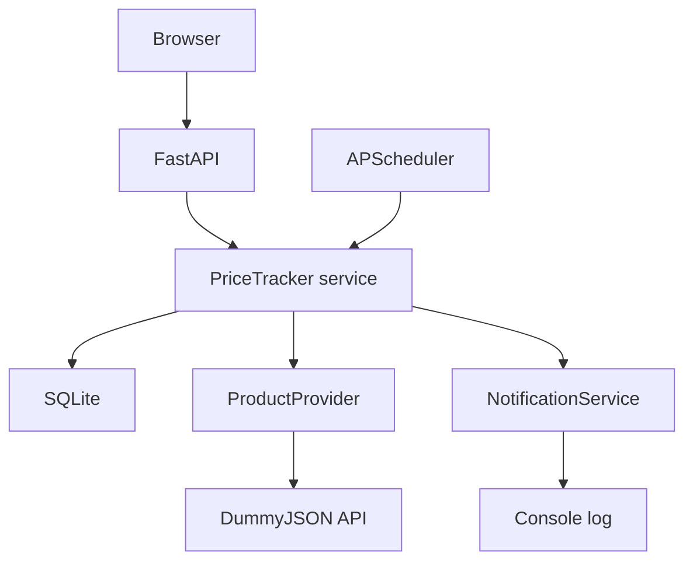

# Price Tracker

A focused, single-user price watchlist built with **FastAPI, SQLite, and vanilla JavaScript**.
Discover products, set a target, and follow every price check on a chart. An alert is
written to the application log when a price reaches your target.

Python 3.12+ · SQLAlchemy · APScheduler · Jinja2 · Chart.js · Docker · MIT

## Features

- Browse and search the DummyJSON catalog, with pagination.
- Track products, change targets, refresh manually, and delete a product and its history.
- Current, first, minimum and maximum prices, absolute change, and percentage change.
- Responsive dashboard and product pages with a price/target chart and accessible history table.
- Automatic checks, configurable interval, and independent error handling per product.
- Optional simulated fluctuations, clearly marked in the UI.
- Exact integer-cent storage, Decimal calculations, UTC timestamps, and typed API responses.
- Provider and notification abstractions; no DummyJSON logic in the tracker service.
- OpenAPI/Swagger, isolated mocked tests, Docker health check, persistent volume, and GitHub CI.

## Architecture



`create_app()` owns the database, shared async HTTP client and scheduler lifecycle.
FastAPI injects `PriceTracker` into routes. A provider returns validated domain
schemas. Short SQLAlchemy sessions handle local storage; network requests run
asynchronously outside database transactions. One in-process lock serializes
mutations, preventing competing manual/background refreshes and duplicate alerts
in normal operation. SQLite uses WAL and enforced foreign keys.

Money is stored as integer cents and exposed as Decimal **strings** in JSON,
for example `"79.99"`. API input accepts decimal strings or numbers with at most
two decimal places. Values are nonnegative; zero-price percentage changes return
`null` instead of dividing by zero. Change is always measured against the first
recorded price. UTC timestamps use ISO 8601; the browser displays local time.

## Screenshots

> Add screenshots here.

## API

| Method | Endpoint | Purpose |
| --- | --- | --- |
| GET | `/api/health` | Process liveness |
| GET | `/api/products/search?q=phone&limit=12&skip=0` | Search; empty `q` browses catalog |
| POST | `/api/tracked` | Add `{ "external_id": 1, "target_price": "9.00" }` |
| GET | `/api/tracked` | All tracked products with statistics |
| GET | `/api/tracked/{id}` | One product with statistics |
| GET | `/api/tracked/{id}/history` | History in insertion order, oldest first |
| POST | `/api/tracked/{id}/refresh` | Fetch and save another observation |
| PATCH | `/api/tracked/{id}` | Update `{ "target_price": "8.50" }` |
| DELETE | `/api/tracked/{id}` | Delete product and history; 204 |

Create returns 201. Missing products return 404, duplicates 409, invalid inputs
422, and provider failures 502. Failed fetches preserve the previous price,
last-check timestamp and history. The dashboard and existing history remain
available during a provider outage. Provider requests have a ten-second timeout;
background failures are logged and the remaining products continue updating.

Interactive API: [Swagger UI](http://localhost:8000/docs).
Full schema: [OpenAPI JSON](http://localhost:8000/openapi.json).

## Quick Start

Use Python 3.12 or newer. From the project directory:

```bash
python -m venv .venv
source .venv/bin/activate
# Windows PowerShell: .venv\Scripts\Activate.ps1
pip install -r requirements.txt
cp .env.example .env
uvicorn app.main:app --reload
```

Open [the dashboard](http://localhost:8000). SQLite tables are created automatically;
no migrations, tokens or manual seed step are needed. Search for a product, enter
a target, click **Track**, then open **View history**. **Refresh** adds another point.
Set a target at or above the current price to test the console alert.

For an API-only quick check:

```bash
curl http://localhost:8000/api/health
curl 'http://localhost:8000/api/products/search?q=phone'
curl -X POST http://localhost:8000/api/tracked \
  -H 'Content-Type: application/json' \
  -d '{"external_id":1,"target_price":"10.00"}'
```

The provider uses the documented [DummyJSON product endpoints](https://dummyjson.com/docs/products).
DummyJSON is a sample catalog, not a live marketplace. Internet access is needed
for catalog requests, product images and the pinned Chart.js CDN asset. If the
chart CDN fails, the history table remains available.

## Docker

```bash
docker compose up --build
```

Open [http://localhost:8000](http://localhost:8000) and
[http://localhost:8000/docs](http://localhost:8000/docs).
No `.env` file is required for Docker; defaults are supplied by Compose.
An optional `.env` overrides simulation and scheduling. Compose deliberately sets
its database URL to `/app/data/price_tracker.db` in the named volume.

```bash
docker compose logs -f app  # Look for PRICE ALERT
docker compose down        # Data remains in the named volume
```

The container runs as a non-root user. The port binds to localhost. Run exactly
**one worker and one replica**: each process would otherwise start its own
scheduler. `--reload` is for development only.

## Configuration

| Variable | Default | Meaning |
| --- | --- | --- |
| `APP_NAME` | `Price Tracker` | OpenAPI application title |
| `DATABASE_URL` | `sqlite:///./price_tracker.db` | SQLite file; parent directory must exist |
| `PRICE_CHECK_INTERVAL_SECONDS` | `60` | Positive interval, seconds |
| `SIMULATE_PRICE_CHANGES` | `true` | Enable demo fluctuations |
| `SCHEDULER_ENABLED` | `true` | Turn off automatic checks when false |
| `TELEGRAM_BOT_TOKEN` | empty | Reserved; Telegram adapter is not implemented |
| `TELEGRAM_CHAT_ID` | empty | Reserved; Telegram adapter is not implemented |

Environment variables take precedence over `.env`. Never commit `.env` or tokens.
All prices in this MVP are treated as USD.

### Why simulation exists

DummyJSON prices normally remain unchanged. With `SIMULATE_PRICE_CHANGES=true`,
each **manual or scheduled refresh** applies a random factor from 0.95 to 1.05
to the freshly fetched API price and rounds to cents. The first observation uses
the real API price. Changes always use the API price as the base, so they do not
compound. Each successful refresh creates a history row even if the price is unchanged.
Simulation is a demonstration aid, clearly labeled in the UI; it is not market data.
Set the variable to `false` to store the API price without modification and restart.

### Alert behavior

`ConsoleNotificationService` writes `PRICE ALERT: ...` when current price is at or
below target, including on initial tracking and target edits. While the price
stays below the same target, repeated checks do not send more alerts. A rise above
target rearms the alert. Changing the target also rearms it; saving the same target
does not. Notification failures are logged, the price is still committed, and a
later check retries. This is best-effort delivery: a process crash between sending
and committing could cause a repeated alert. A transactional outbox would be the
next step for durable external delivery. Telegram is intentionally optional future
work; this version always uses the console adapter.

## Running tests

```bash
pytest
```

Tests use temporary SQLite files and injected fake providers or `httpx.MockTransport`;
no live API or tokens are required. Coverage includes CRUD, history/statistics,
validation, duplicate handling, provider timeouts/errors, simulation bounds/base,
alert deduplication/rearming/retry, exact cents, batch error isolation, concurrent
refreshes, and an actual scheduler execution and shutdown.

CI runs pytest on Python 3.12 and 3.13, validates Compose and builds the image.
See `VERIFICATION.md` for checks actually run during project creation.

## Project structure

| Path | Responsibility |
| --- | --- |
| `app/main.py` | App factory, lifespan, web pages and error mapping |
| `app/config.py`, `app/database.py` | Settings, sessions, money and UTC types |
| `app/models/` | TrackedProduct and PriceHistory |
| `app/schemas/` | Validated requests and API responses |
| `app/api/routes.py` | REST routes and dependency injection |
| `app/services/price_tracker.py` | Tracking, statistics, alerts and refresh jobs |
| `app/services/providers/` | Provider interface and DummyJSON adapter |
| `app/services/notifications.py` | Notification interface and console adapter |
| `app/templates/`, `app/static/` | Jinja2 templates, CSS and vanilla JS |
| `tests/` | API, service, provider and scheduler tests |
| `.github/workflows/tests.yml` | Test and Docker build CI |
| `Dockerfile`, `docker-compose.yml` | Container and persistent SQLite volume |

## Limitations

A single-user, local MVP: no authentication, multi-currency support, database
migrations, rate limiting or durable notification queue. Do not expose it publicly
without access control. SQLite and the in-process scheduler are designed for one
small deployment, not multiple workers. Sync SQLite operations are short but run
on the event loop; large watchlists should move to async storage or worker threads.
History is retained without limit and loaded for statistics; add aggregation and
pagination before scaling. Chart x positions are equally spaced observations,
with timestamps as labels. No GitHub remote is configured by the project itself.

## Future improvements

- PostgreSQL with Alembic migrations
- Redis and Celery for distributed scheduling
- User authentication
- Amazon/eBay providers
- Email notifications
- Telegram notifications
- Discord webhook
- Price-drop percentage alerts
- Deployment with access control and monitoring
- React frontend if the UI grows beyond the current scope

## License

[MIT](LICENSE).
